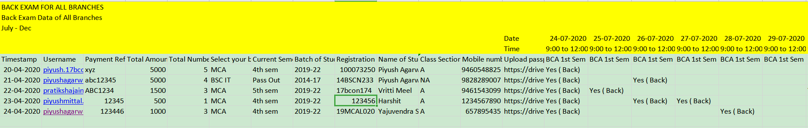

# Back Admit Cards Generate

## Setup
1. Save the ```Team 7``` folder in the ```Packages``` Folder
2. Set the path to ```Images``` folder,```Output``` folder and path of ```Word Application``` that is ```winword.exe```
3. Save the ```Default.jpeg``` image in the ```Images``` Folder mentioned in step 2

## UseCase
* This Bot is developed to create back admit cards for students of JECRC University.
* It uses the Excel Input that is obtained through google forms and manual entry of teachers for the date and time of exam

## Process
* The Bot asks for Excel File with students back data
* The Bot will check the file for proper headers and validation
* If the file is proper, then Word Application is opened
* The Image is changed and the Image name selected by the bot is ```Registration No of Student - Name of Student.jpeg```
* Thus, the students must upload the images with name as there registration number and in .jpeg extension. e.g., ```17BCON173.jpeg```
* The Bot starts filling up the Basic Details of the students and entries for subjects in which student has back
* Once all the files are created you can find an Output Folder created on the location that was setup in ```OutputFolderPath```
* Each Admit Card is saved in ```Output/WorkbookName-Sheet1``` folder

## Exceptions Handled in Process
* If no image is found, then an Default.jpeg is selected from the Images Folder which is asked to save during setup process
* If a student has no back then his basic details ae written but admit card is deleted before preceding to next entry
* If any garbage value is present in excel input file it will be ignored
* As per the process instructed by teachers, LAB subjects do not have Date/Time written in Admit Card

## Samples
Excel File that is generated by google forms and given to bot looks like this

